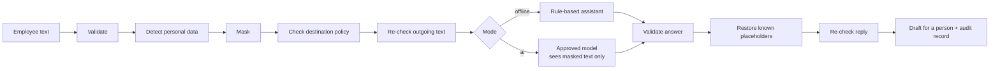

# sitr

**sitr keeps people's personal data out of AI models.** It sits between a message and the
model: personal data is taken out before the model sees the text. Names, phones and emails
are put back only for the person who reads the reply; Emirates ID numbers never are.

*sitr* (ستر) is Arabic for "to veil, to shield".

## The problem

Employees write to HR, admin and IT desks in plain language, and those messages carry
personal data: names, phone numbers, email addresses, Emirates ID numbers. Organisations
want AI to help handle these requests, but the text cannot simply be sent to a model. The
personal data would leave the organisation, reach a service nobody approved, and end up
in prompts and logs.

## The solution

sitr is the boundary every message passes through on the way to a model, and every reply
passes back through on the way to a person.

| | |
|---|---|
| **The employee writes** | Hi, I'm Sarah Mitchell, Emirates ID 784-1990-1234567-1. Call me on 050 123 4567 about my salary certificate for a car loan. |
| **The model sees** | Hi, I'm `[NAME_1]`, Emirates ID `[EID_MASKED]`. Call me on `[PHONE_1]` about my salary certificate for a car loan. |
| **The person reads** | Dear Sarah Mitchell, thank you for your salary certificate request. We have everything we need… |
| **The audit record says** | `NAME 1 · EID 1 · PHONE 1 · destination offline/local, approved · decision drafted` and nothing else |

Before anything leaves, sitr finds the personal data and replaces it with placeholders.
Names, emails and phones can be restored later; the mapping lives in memory for that one
request. Emirates ID numbers are blanked for good and never leave. sitr then checks the
destination against a written policy, re-checks the outgoing text and refuses to send if
anything slipped through, restores the placeholders in the reply for the human reader, and
writes an audit record that contains counts, never the data.

A person stays in charge: sitr drafts, it never sends. Anything it cannot recognise,
anything malformed, and anything that looks like an attempt to manipulate it is handed to
a person with the reason stated.

To show the boundary doing real work, sitr ships with a small reference assistant for an
employee-services desk (salary certificates, NOC letters, leave, IT access). The assistant
only ever sees the cleaned text. That is the point: it does its job without ever seeing
anyone's personal data.

**Offline mode is the complete product.** It needs no API key, no account, no network and
no separate model download. AI mode is optional; it shows that the same boundary holds
when a real model is behind it, and nobody has to run it to evaluate the project.

sitr is one technical control that supports data minimisation, designed with the UAE
Personal Data Protection Law in mind. It is not a compliance product and makes no compliance
claims. All sample data is synthetic; no real people, ever.

## How it works



1. **Validate.** Empty, oversized, non-English, suspicious, or placeholder-containing input
   is handed to a person with the reason stated. sitr never crashes and never guesses.
2. **Detect.** Emirates ID numbers, phone numbers (UAE mobile and landline, international)
   and email addresses by pattern, Arabic-Indic digits included; personal names with a small
   statistical model that installs as an ordinary dependency, plus a second pass for
   lowercase names after a self-introduction or sign-off.
3. **Mask.** Names, emails and phones become `[NAME_1]`, `[EMAIL_1]`, `[PHONE_1]` with a
   mapping held in memory for this request only. Emirates IDs become `[EID_MASKED]` and
   are never stored, mapped or restored.
4. **Check policy.** In AI mode the destination must be declared and approved in
   `policy.yaml`. Anything else is refused before any text moves.
5. **Re-check.** Every detector runs again on the outgoing text. If anything is found, the
   request is refused and nothing is sent.
6. **Answer.** Offline, a rule-based assistant classifies the request, lists what is
   missing and drafts a reply addressed to whoever wrote in. In AI mode a model does the
   same from the masked text.
7. **Validate the answer.** It must be well-formed and name a known request type.
8. **Restore.** Only placeholders from this request's own mapping are put back. Anything
   else stays literal and the result is flagged for review.
9. **Re-check the reply** for Emirates IDs before it is shown.
10. **Audit.** One JSON line per request: categories and counts, destination, decision,
    reason, and whether the reply needs review. Never the text, never the mapping.

| Never leaves the boundary | Leaves only in AI mode | In the audit record |
|---|---|---|
| Raw text, the placeholder mapping, Emirates ID values | Of the message, only the masked text, to the one approved destination in `policy.yaml` (with the ordinary request metadata: key, prompt, model ID, temperature) | Counts per category, destination (provider, region, approved), request type, decision, reason, needs-review flag |

## Why it holds

- **You cannot leak what you never saw.** The original text, the placeholder mapping and
  every Emirates ID stay inside the boundary; no model ever receives them. What a model in
  AI mode receives is the masked text, with a placeholder for everything the detectors found
  (measured below), treated as data, never instructions. Its answer is checked against a
  closed set of request types and placeholders are restored only from the request's own
  mapping, so a manipulation cannot reach anything sitr holds.
- **Fails closed.** Any stage can refuse. Every refusal is one of nine named reasons, handed
  to a person, and audited. No error path sends text anyway.
- **Security in code, policy in configuration.** Detectors, placeholder format and output
  validation are code, and tested. Where text may go and what the assistant says are YAML
  an operator changes without a deploy.
- **Nothing retained.** The mapping lives in memory for one request. There is no store to
  secure and no retention policy to write.
- **Tested, not promised.** "No personal data in logs" is an assertion over captured log
  output, and detection precision and recall are numbers gated in CI, both run on every
  pull request.

## Quick start

With [uv](https://docs.astral.sh/uv/). Python 3.12+ is fetched automatically if missing.

```bash
git clone https://github.com/umarmk/sitr && cd sitr
uv sync                                        # everything, including the name model
uv run pytest -q                               # the whole suite; nothing touches the network
uv run sitr templates                          # example requests (all people fictional)
uv run sitr run --template salary-certificate  # one request, offline
uv run sitr serve                              # web UI at http://127.0.0.1:8000
```

Without uv, on an existing Python 3.12+:

```bash
python3 -m venv .venv && source .venv/bin/activate
pip install -e . pytest ruff httpx2   # editable: policy.yaml and config.yaml are read from the checkout
pytest -q
sitr serve
```

### What a run looks like

<!-- example:start -->
```
$ uv run sitr run --template salary-certificate
sitr.audit {"request_id":"…","timestamp":"…","mode":"offline","destination":{"name":"offline","provider":"local","region":"local","approved":true},"categories":{"NAME":1,"EID":1,"PHONE":1,"EMAIL":1},"request_type":"salary_certificate","decision":"drafted","refusal_reason":null,"needs_review":false}
decision      drafted
request type  salary_certificate
missing       -
destination   offline · local · local · approved
detected      EID 1, EMAIL 1, NAME 1, PHONE 1

--- what the model saw ---
Hello, my name is [NAME_1] and I work in the finance team. I need a salary certificate addressed to Emirates NBD for a car loan. My Emirates ID is [EID_MASKED]. Please call me on [PHONE_1] or email [EMAIL_1] if you need anything else.

--- draft reply (restored, for a person to review) ---
Dear Sarah Mitchell,

Thank you for your salary certificate request. We have everything we need and will process it shortly.

Kind regards,
Employee Services
```
<!-- example:end -->

The first line is the audit record, written to stderr. The draft is restored for the
person who will review and send it; the model never saw the name.

`sitr run` also accepts free text as an argument or on stdin, `--json` for the full
result, and exits `0` when a draft was produced, `1` when the request was handed to a
person, `2` on a usage or configuration error.

## The web UI

`uv run sitr serve` binds to `127.0.0.1:8000` by default. Pass `--host 0.0.0.0` only if
you mean to expose it.

The page offers the two modes, the example requests as templates, and free text. Every
result shows the decision, the destination (provider, region, approved or not), the
request type and missing items, the personal-data counts, **the exact text the model saw**,
the restored draft, and the audit record. AI mode is shown disabled, with the reason, on a
machine that cannot run it. No secret ever reaches the browser: the server reports only a
boolean for "AI available", and there is no key field in the page.

The API behind it is three endpoints, documented at `/docs`: `GET /api/capabilities`,
`GET /api/templates`, `POST /api/process`.

| A drafted request | A refusal, handed to a person |
|---|---|
|  |  |

## AI mode (optional)

AI mode sends the masked text, and only the masked text, to one destination declared in
`policy.yaml`, through [OpenRouter](https://openrouter.ai/). It reads one secret from the
environment and nothing else.

```bash
cp .env.example .env            # put OPENROUTER_API_KEY in it; .env is gitignored
uv run --env-file .env sitr serve
uv run --env-file .env sitr run --mode ai --template noc-letter
```

The default destination in `policy.yaml` names a free-tier model, so trying AI mode costs
nothing beyond a key. Change `destinations[].model` to any OpenRouter model ID.

To see the policy refuse, ask for the destination that is declared but not approved:

```bash
uv run --env-file .env sitr run --mode ai --destination example-unapproved --template leave
# decision      handed_to_person (destination_not_approved: destination 'example-unapproved' (ExampleCloud, EU) is not approved)
```

Nothing was sent; the audit record says so.

## Configuration

Everything an operator should tune lives in two YAML files at the project root. The
detectors, placeholder format and validation rules are deliberately code: they are the
security control.

- **`policy.yaml`** — what may go where. Each destination has a name, provider, region,
  `approved: true|false` (a real boolean; a quoted string is rejected at load), and the
  model ID. Undeclared destinations are refused. Offline mode never reads this file.
- **`config.yaml`** — how the assistant behaves: the input cap, model timeout and
  temperature, the system prompt, the four request types with their keywords and
  required-item cues, the cues that identify who wrote the message, the sentences the
  offline assistant writes, the manipulation patterns, and the example templates. Every
  keyword and cue is a case-insensitive regular expression, and the file is validated in
  full at load.

`OPENROUTER_API_KEY` is the only environment variable. See `.env.example`.

## When sitr says no

Each refusal is handed to a person with the reason stated, and still produces an audit record.

| Reason | Trigger |
|---|---|
| `empty`, `too_long` | Blank input, or more than the configured cap (4,000 characters) |
| `non_english` | Arabic script, mostly non-ASCII letters, or text that is not valid Unicode |
| `suspected_manipulation` | Instruction-like phrases ("ignore previous instructions"), or literal placeholder tokens in the input |
| `unrecognised_request` | No known request type matched |
| `destination_not_approved` | AI mode with a destination that is undeclared or `approved: false` |
| `outgoing_recheck_failed` | Personal data survived masking, or an Emirates ID appeared in the reply |
| `model_unavailable` | No key, or the gateway could not be reached or errored |
| `model_output_invalid` | The model did not return a well-formed JSON answer with a known request type |

## Tests and CI

155 tests, no network, under ten seconds.

```bash
uv run pytest -q
uv run ruff check . && uv run ruff format --check .
uv run python tests/test_quality.py   # detection precision and recall per category
```

The suite asserts:

- **no personal data in logs or audit records**, over captured log output;
- the outgoing re-check refusing when masking is deliberately broken;
- the Emirates ID never restorable, even when the name model glues it onto a name;
- every refusal reason; malformed model output and text that is not valid Unicode are
  refused, not raised; malformed configuration fails loudly at load (CLI exit 2, HTTP 503)
  instead of mid-request;
- the policy refusing undeclared and unapproved destinations, and a hostile destination
  name never reaching the log;
- AI mode against an in-process fake gateway: only placeholders leave, the key never
  appears in any output, and HTTP, JSON and closed-set failures are refused, not raised;
- the web endpoints and the CLI;
- detection quality on a labelled synthetic corpus of 109 desk messages, gated per
  category:

| Category | Values | Precision | Recall |
|---|---|---|---|
| Names | 60 | 93.4% | 95.0% |
| Phone numbers | 33 | 100% | 100% |
| Email addresses | 14 | 100% | 100% |
| Emirates IDs | 9 | 100% | 100% |

Measured on 2026-09-06 with the pinned `en_core_web_sm` 3.8.0. The three name misses are
two sentence-initial names the model reads as places and one lone first name after a
sign-off; the four false positives are over-masking of a system, a bank, a city and a road,
the safe direction. CI fails if any category drops below its threshold.

Built as a series of small pull requests against a PR-only `main`, each reviewed before
merge, with seven decision records in `docs/adr/`. CI runs the same commands on Python 3.12
and 3.14.

## Project layout

```
sitr/
  boundary.py    process(): the orchestration above
  detect.py      regex + spaCy detectors behind one detect()
  mask.py        placeholders, per-request mapping, restore()
  policy.py      destination resolution and refusal
  model.py       Model protocol, RuleBasedModel (offline), OpenRouterModel (AI)
  assistant.py   keyword classification, missing items, requester, drafts (all from config)
  audit.py       one JSON line per request via logging
  config.py      policy.yaml / config.yaml loaders and validation
  refusal.py     the one exception that hands a request to a person
  cli.py         sitr run | templates | serve
  web.py         FastAPI app; static/index.html is the page
policy.yaml, config.yaml
tests/           pytest; fake gateway for AI mode; quality/ holds the labelled corpus
docs/            SPEC.md, ARCHITECTURE.md, adr/
```

## Scope

The first version covers what an employee-services desk in the UAE actually sees, and says
so precisely:

- **Four categories:** personal names, Emirates ID numbers, phone numbers (UAE mobile and
  landline, international) and email addresses, in Western or Arabic-Indic digits. Passport
  numbers, IBANs and addresses are the next categories, one pattern each behind `detect()`.
- **English messages.** Arabic-script text is handed to a person rather than guessed at.
- **Measured, gated detection.** The numbers above are the contract. Lowercase names after
  a self-introduction or sign-off get a second, recased pass; the remaining misses are names
  the model reads as places, which is one reason a person reviews every draft.

Two things are decisions, not gaps:

- **Emirates IDs are matched by format, without a checksum.** A checksum would only teach
  sitr to ignore a mistyped ID, and a mistyped ID is still personal data. Over-detection is
  the safe direction, and a format match already goes irreversible.
- **The manipulation check is triage, not the control.** The control is architectural: the
  original text, the mapping and every Emirates ID never reach a model, and nothing is
  restored except from the request's own mapping. The keyword check saves a person's time;
  the architecture keeps the data.

## If I had more time

sitr today guards one prompt and one reply for one desk. The same boundary, unchanged in
principle, is what an organisation needs on every hop between its people and its models.

1. **Every hop, both directions.** An agent makes many calls: model turns, tool calls, tool
   results, retrieved documents. Run sitr as a gateway on each of them, with per-tool and
   per-destination policy, streaming support, and one session-scoped mapping so placeholders
   stay consistent across turns and are restored only at the human edge.
2. **A real agent behind AI mode.** The `Model` Protocol already isolates the model. Replace
   the single JSON call with an agent that reads the request, looks up the employee record by
   placeholder-safe keys, fills the certificate or letter template, and queues it for
   approval, working on placeholders throughout. Restoration happens once, on the approval
   screen. A person remains the last step.
3. **Detection with numbers attached.** Grow the quality corpus into a benchmark: more
   categories (passport numbers, IBANs, dates of birth, addresses, salaries), Arabic-script
   names, a transformer model behind the same `detect()` with the small model kept as the
   offline default, and the recall gate already in CI keeping quality from dropping silently.
4. **Compliance evidence, not compliance claims.** Signed, tamper-evident audit chains
   exported to a SIEM; per-tenant policy packs mapping destinations to regions and legal
   bases; data-subject request support (nothing is retained, and the audit proves it);
   records-of-processing and DPIA inputs generated from the policy. The architecture already
   gives a UAE PDPL programme its three hard parts: minimisation by default, cross-border
   control by policy, and a record of every decision.
5. **Operate it.** Keys in a secrets manager, per-user rate and spend limits, multi-tenancy,
   a placeholder vault with retention rules for workflows that must span sessions, and a
   proxy mode so any existing application gets the boundary by changing one base URL.

## Documentation

- [Specification](docs/SPEC.md) — scope, requirements, refusal conditions, acceptance tests
- [Architecture](docs/ARCHITECTURE.md) — data flow, modules, configuration, trust boundaries
- [Decision records](docs/adr/) — why each significant choice was made
