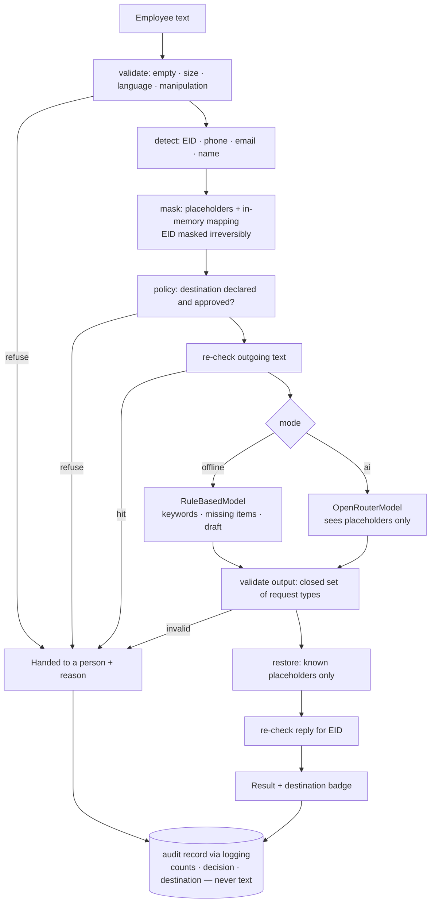

# Architecture

## Data flow



**Never leaves the boundary:** raw text, the placeholder mapping, Emirates ID values.
**Leaves only in `ai` mode:** of the message, the masked text only, to the one approved
destination in `policy.yaml`, alongside the ordinary request metadata (key, system prompt,
model ID, temperature, attribution headers).

## Modules

| Module | Responsibility |
|--------|----------------|
| `sitr/config.py` | Load and validate `policy.yaml` and `config.yaml` into dataclasses. |
| `sitr/refusal.py` | `Refusal(reason, detail)`: the one exception any stage raises to hand a request to a person. Reasons are the closed set in SPEC §4; details are static text. |
| `sitr/detect.py` | Detectors: regex for EID, UAE mobile, email; spaCy `PERSON` for names. One `detect(text) -> list[Span]` entry point used by masking and both re-checks. |
| `sitr/mask.py` | Replace spans with placeholders; build per-request mapping; `restore(text, mapping)` restores known placeholders only. |
| `sitr/policy.py` | Resolve a destination by name; refuse undeclared or unapproved. |
| `sitr/audit.py` | Build the audit record and emit it as one JSON line through `logging`. |
| `sitr/model.py` | `Model` Protocol; `RuleBasedModel` (offline); `OpenRouterModel` (stdlib `urllib`, key from env). |
| `sitr/assistant.py` | Request-type keyword scoring, missing-items check, draft text. Used by `RuleBasedModel`. |
| `sitr/boundary.py` | `process(text, mode, destination) -> Result`. The orchestration in the diagram above. |
| `sitr/cli.py` | `sitr run`, `sitr templates`, `sitr serve`. Thin wrapper over `process()`. |
| `sitr/web.py` + `sitr/static/index.html` | FastAPI app: `POST /api/process`, `GET /api/templates`, `GET /api/capabilities`; one static page, no build step. |

## Configuration

Everything an operator should tune lives in two YAML files at the project root, loaded
with `yaml.safe_load`. Detectors, placeholder format, refusal reasons and output validation
are code on purpose: they are the security control.

```yaml
# policy.yaml — what may go where. A security control.
default_destination: openrouter

destinations:
  - name: openrouter
    provider: OpenRouter
    region: US
    approved: true
    model: minimax/minimax-m3:free   # any OpenRouter model ID; free tier by default
  - name: example-unapproved      # exists so the refusal path can be demonstrated
    provider: ExampleCloud
    region: EU
    approved: false
    model: example/model
```

```yaml
# config.yaml — how the assistant behaves.
input_max_chars: 4000
model:
  timeout_seconds: 30
  temperature: 0
  system_prompt: |
    ...
request_types:
  salary_certificate: { keywords: [...], required: [addressee, purpose] }
  noc_letter:         { keywords: [...], required: [purpose, dates] }
  leave:              { keywords: [...], required: [dates, leave_type] }
  it_access:          { keywords: [...], required: [system_name] }
templates:
  - { id: salary-certificate, title: "...", text: "..." }
drafts:                      # sentences the rule-based assistant writes
  greeting_named: "Dear [NAME_1],"   # restored to the real name before display
  body_missing: "... please provide the following: {items}."
manipulation_patterns: ["ignore previous instructions", "system prompt", ...]
```

Offline mode uses an implicit destination `local / offline / approved: true`.

**Environment:** `OPENROUTER_API_KEY` is the only variable. Absent → `ai` mode is
unavailable and the UI says so. Never echoed anywhere.

## Tech stack

| Choice | Why |
|--------|-----|
| Python ≥ 3.12, `uv`, `uv.lock` | One-command reproducible install; `uv` fetches the interpreter if missing. `pip install -e .` documented as fallback. |
| `fastapi` + `uvicorn` | Request-shape and mode validation at the trust boundary for free; `/docs` for the reviewer. The size cap stays in the boundary so oversized input is refused with an audit record, not a 422. |
| One static HTML page | No build step, nothing to install for the UI. |
| `spacy` + pinned `en_core_web_sm` wheel | Name detection as an ordinary dependency: no download step, no account. |
| `re` for EID / phone / email | Structured formats; regex is the correct tool. |
| stdlib `urllib` for OpenRouter | One POST does not justify a client library; trivially faked in tests. |
| `pyyaml` | Human-editable policy and config with comments. |
| `logging` for audit | Standard sink; the no-PII test captures it directly. |
| `pytest`, `ruff`, `httpx` (test client only), GitHub Actions (3.12, 3.14) | Team-standard hygiene. |

## Trust boundaries and threats

- **Employee text is data, never instructions.** Offline mode has no instruction channel
  at all. In `ai` mode the model only ever holds placeholders, its output is validated
  against the closed set of request types, and placeholders are restored only from the
  request's own mapping. A successful manipulation has nothing to leak.
- **Leakage paths considered:** logs (structured audit only, tested), exceptions (never
  include text), model request (outgoing re-check), UI (localhost, no secrets), audit
  record (categories and counts only), restored reply (EID re-check).
- **What the re-check does and does not guarantee.** Masking and the outgoing re-check
  share `detect()`. The re-check therefore proves that masking *applied* everything the
  detectors found; it cannot find a format the detectors do not know. Detector coverage
  is a stated limitation (SPEC §7) and is tested per format, not compensated for at
  runtime.
- **Secrets:** environment only, server side only; no key field in the UI; `.env`
  gitignored; `/api/capabilities` returns booleans, never values.
- **Network surface:** `127.0.0.1` by default; `--host` must be passed explicitly to
  expose it. No CORS middleware. Hosted-instance protections are out of scope (SPEC §1).

## Delivery

`main` is PR-only. Each PR is small and single-purpose. CI runs `ruff check`,
`ruff format --check` and `pytest` on Python 3.12 and 3.14. Decisions are recorded in
`docs/adr/`.
